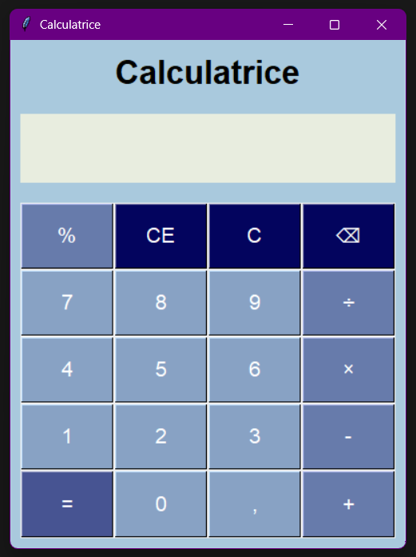

# 🧮 Python GUI Calculator

A fully functional desktop calculator built with **Python** and **Tkinter**.

## 📖 Context & Story
I developed this project as a **self-taught initiative** during my undergraduate studies in **Applied Foreign Languages (LEA)**.
Before starting my Master's in IS Management, I wanted to challenge myself by building a concrete tool with a Graphical User Interface (GUI). This project represents my first successful deep dive into Python logic and event handling.

## ✨ Features
* **User Interface:** Clean and colorful GUI using `tkinter`.
* **Dual Input:** Works with both mouse clicks and **keyboard input** (Numpad support).
* **Responsive Layout:** The interface adapts automatically when resizing the window.
* **Operations:** Basic arithmetic (+, -, *, /) and **percentage handling**.
* **Robustness:** Includes error handling (avoids crashing on invalid divisions).
* **Logic:** Use of Regex (`re`) to parse and calculate percentages dynamically.

## 📸 Preview

*(Note: If the image doesn't load, please run the code to see the interface!)*

## 🛠️ Technologies Used
* **Language:** Python 3.x
* **Libraries:**
    * `tkinter` (Standard GUI toolkit)
    * `re` (Regular Expressions)

## 🚀 How to Run
Since this project uses Python's standard libraries, no external installation (`pip install`) is required.

1.  Clone the repository:
    ```bash
    git clone [https://github.com/AbdoullahB/NomDeTonRepo.git](https://github.com/AbdoullahB/NomDeTonRepo.git)
    ```
2.  Navigate to the folder and run:
    ```bash
    python main.py
    ```

## 🧠 What I Learned
Through this project, I understood the basics of:
* **Event Driven Programming:** Binding keyboard keys to functions.
* **Grid Layouts:** Managing positioning in a GUI.
* **Data Handling:** converting strings to executable math logic.
